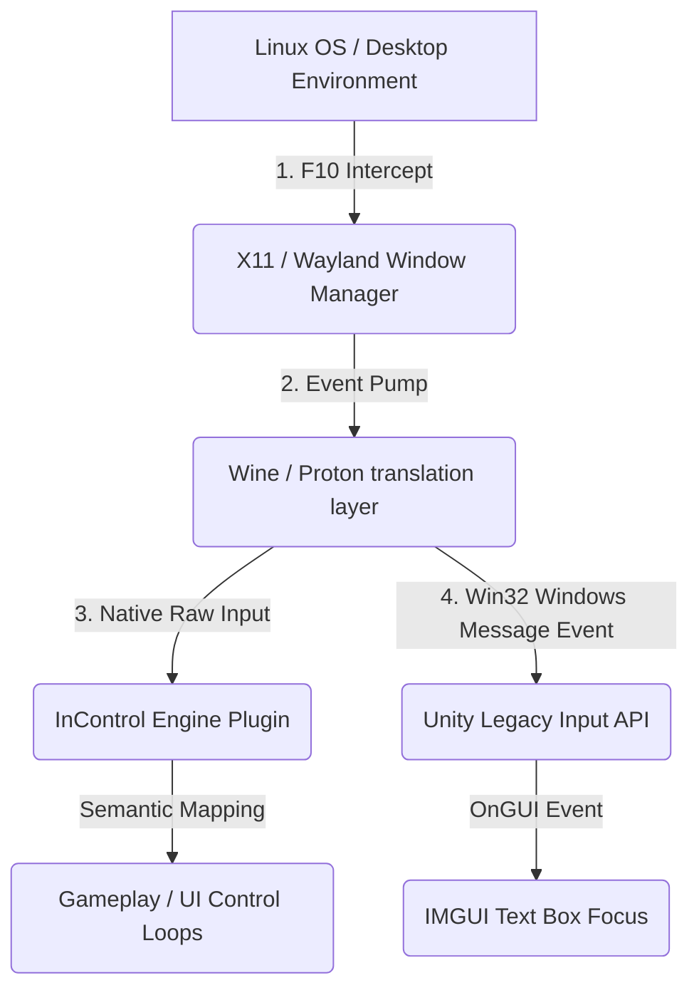

# Hollow Knight Linux/Proton Input Modding Fix: Detailed Technical Analysis

This document provides a comprehensive technical analysis of the input routing, key intercept, and GUI focus issues encountered under Linux/Proton for the Hollow Knight multiplayer mod (`betterMultiplayer`), along with the engineering solutions implemented to resolve them.

---

## 1. System & Engine-Level Root Causes

When running a Unity game (compiled for Windows/DirectX/Win32) on Linux via Steam Proton (Wine-based compatibility layer), input events go through a complex translation pipeline:



### Root Cause A: X11/Wayland Desktop Environment Intercepts (`F10`)
* **Symptom**: Pressing the `F10` key in-game does not toggle menu visibility.
* **Mechanism**: Desktop environments on Linux (such as GNOME, KDE Plasma, COSMIC, and XFCE) utilize `F10` as a global hotkey to trigger the application menu bar. When the game runs, the window manager intercepts the keypress at the display server layer (X11/Wayland) before forwarding events to the active Proton client. Consequently, the game window never receives the virtual key event for `F10`.

### Root Cause B: IMGUI Focus Invalidation under Wine/Proton
* **Symptom**: The user can see the IP text field, but clicking it does not allow typing or backspacing.
* **Mechanism**: 
  * In Unity's legacy Immediate Mode GUI (IMGUI) system, controls drawn outside of a registered window container (via `GUI.TextField` called directly in `OnGUI`) do not establish a distinct win32-like window context. 
  * Under Proton/Wine, mouse clicks and raw keyboard events are translated into standard Win32 window message events (like `WM_KEYDOWN` and `WM_LBUTTONDOWN`). If IMGUI controls are drawn directly on-screen, the active keyboard focus state gets immediately overwritten or "stolen" by the game's main input loop and the `InControl` native plugin's low-level device polling.
  * Because the game's gameplay input loop is continuously polling, it intercepts the keyboard events. The GUI text field is starved of key events, making typing impossible.

### Root Cause C: SDL/XInput Gamepad Driver Mapping Shifts
* **Symptom**: Gamepad shortcut commands (`LB + RB`) fail to toggle the menu.
* **Mechanism**: 
  * On Linux/Proton, controllers are managed via SDL2 gamepad databases. The legacy Unity mapping `Input.GetKey(KeyCode.JoystickButton4)` checks specific button indices.
  * Depending on the driver (e.g. `xpad`, `xboxdrv`, or Steam Input translation), the index mapping for Left Bumper and Right Bumper varies (e.g., swapping button 4/5 with 6/7).
  * Checking hardcoded button keys is therefore non-portable across systems and controllers.

---

## 2. Implemented Engineering Solutions

To ensure a robust, cross-platform experience that handles these system quirks gracefully, the following architecture was deployed:

### Solution 1: Explicit IMGUI `GUI.Window` Wrapping & Active Control Focus
To solve **Root Cause B** (text input starvation), the menu was wrapped in a structured GUI Window, and focus is programmatically locked:

```csharp
void OnGUI()
{
    // ...
    // Draw the menu wrapped inside GUI.Window
    menuWindowRect = GUI.Window(10985, menuWindowRect, DrawMenuWindow, "betterMultiplayer", GUI.skin.box);

    // Force Unity's event pump to route active keyboard input to this window container
    GUI.FocusWindow(10985);
}
```
> [!NOTE]
> By enclosing the controls in a `GUI.Window` and executing `GUI.FocusWindow(id)`, Unity's internal GUI routing manager intercepts Win32-translated keyboard events before they can be claimed by background gameplay input systems. This allows characters, backspaces, and pastes to propagate into the `GUI.TextField` correctly.

---

### Solution 2: Hybrid Key Polling (Legacy Unity + InControl API)
To solve device abstraction issues under Proton:
1. **Fallback Keyboard Input**: The mod queries both Unity's legacy `Input.GetKeyDown(KeyCode.F10)` and the InControl keyboard provider directly:
   ```csharp
   private bool CheckInControlF10Pressed()
   {
       var provider = InputManager.KeyboardProvider;
       if (provider == null) return false;
       return provider.GetKeyIsPressed(Key.F10);
   }
   ```
2. **Device-Agnostic Controller Bumpers**: Rather than polling raw joystick buttons, the mod polls InControl's parsed controller profile:
   ```csharp
   private bool CheckInControlBumpersPressed()
   {
       var device = InputManager.ActiveDevice;
       if (device == null) return false;
       return device.LeftBumper.IsPressed && device.RightBumper.IsPressed;
   }
   ```
> [!TIP]
> Querying InControl's `ActiveDevice.LeftBumper` and `RightBumper` leverages the game's internal hardware-database mappings, ensuring that the mod operates identically regardless of whether the player is on native Linux drivers or Steam Input.

---

### Solution 3: The Persistent Mouse-Based Toggle ("X" Button)
To solve **Root Cause A** (system-level `F10` interception):
* A permanent `25x25` GUI Button labeled `"X"` is rendered at screen coordinates `(10, 10)`.
* Because mouse click event translation operates reliably under Linux/Proton, this button provides a foolproof interface to toggle menu visibility without relying on keyboard key event propagation.
* When the mod menu is closed (`showMenu = false`), the `"X"` button remains rendered to let the player easily reopen the settings menu.
